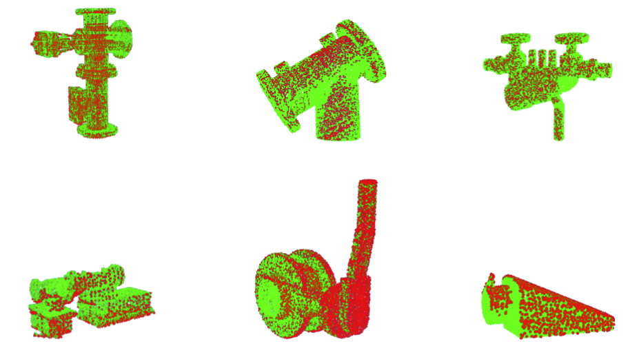
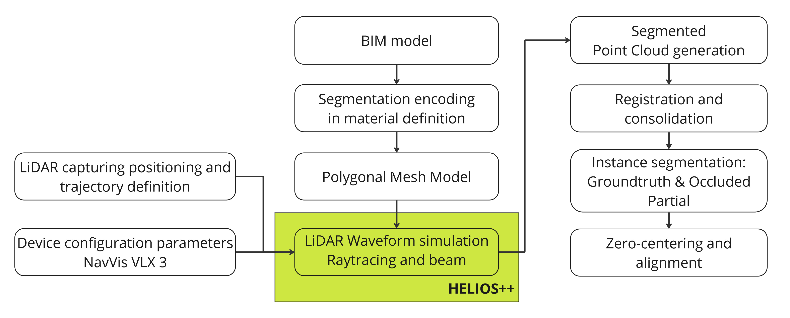

# MEPC-OPPC: Synthetic BIM based Occluded Point Cloud Dataset of MEP Components via Realistic LiDAR Simulation

_Full point cloud vs. partial point cloud: Occluded part (green) and partial point cloud (red) of various model types_

## Abstract

Point clouds are extensively utilized in the Architecture, Engineering, and Construction (AEC) industry for tasks such as factory equipment relocation planning, layout and assembly line planning, global manufacturing operations, 5S and Gemba Walks, best practice sharing, visual interfaces, and Scan-to-BIM processes. An accurate point cloud enhances efficiency and effectiveness in these applications. This paper is utilizing and configuring existing data extraction pipelines for generation, anonymization and alignment of ground truth and partial occluded point cloud data of Mechanical, Electrical, and Plumbing (MEP) components generating and providing pairs of ground truth and occluded point clouds as a coincide dataset. Specifically, a point cloud is generated from detailed Building Information Modeling (BIM) models via simulation of Light Detection and Ranging (LiDAR) output and applying device-specific configuration data from existing commercial devices, replicating the point cloud outcome in reality.  By utilizing the specific labels included in the detailed BIM model data, via point sampling, the ground truth information is being generated in a per-instance fashion, meaning that individual segmented ground truth point clouds of MEP components are created also accompanied by partial counterparts.

## Methodology

## Dataset Discription

In total, the dataset consists of 1,956 files: 284 ground truths and 1,672 partial point clouds. All MEP components together include 1,561 partial point clouds, all non-MEP components contain 111 partial point clouds. The partial point clouds for each object type were aligned to one ground truth in its position which is the file named with the object UID without a number. Each ground truth consists of 16384 points.

## Simulation setup

The settings for the XML files used in Virtual Laser Scanning (VLS) configuration were configured to create a realistic simulation environment and the selected simulated device is the NavVis VLX 3 , a wearable portable LiDAR device which is configured in HELIOS++.

The VLS of a certain space is defined in a survey related XML schema including the path waypoints, the speed of the scanning device, the pulse frequency, head rotation frequency along with starting and ending positions, scanning angle and frequency. The beam divergence was subsequently calculated using provided formulas and integrated into the XML files. 
For configuring the scanner settings, the NavVis VLX 3 device, which includes two XT32M2X 32-Channel Medium-Range Mechanical LiDAR scanners from HESAI , was used. The correct locations of the scanners were set based on HELIOS++ coordinate system definitions. 
The horizontal and vertical scanners were positioned with specific offsets and heights, their channel angles and specifications were detailed in the XML files. The pulse frequency was set to 20,000 points per second.
